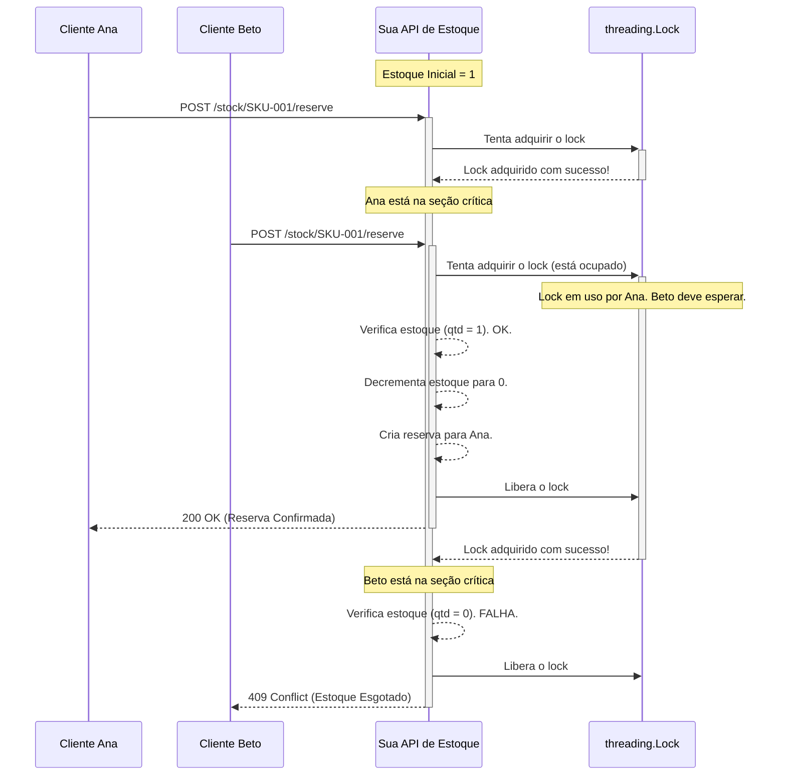
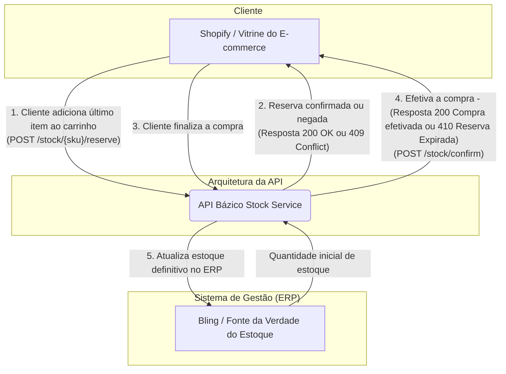

# Desafio de Dados: Serviço de Reserva de Estoque em Tempo Real

Este repositório contém a solução para o Desafio de Dados da Bázico, que consiste em um protótipo de um serviço de reserva de estoque em tempo real para a campanha "BaziWeek".

## Como Executar o Protótipo

Estas instruções permitirão que você configure e execute a API de Reserva de Estoque em um ambiente local.

#### Pré-requisitos

Antes de começar, garanta que você tenha os seguintes softwares instalados:
* **Python 3.10+**
* **Git**

As instruções abaixo são para um ambiente baseado em Linux (como Ubuntu, Debian, ou WSL).

#### 1. Clonar o Repositório

Primeiro, clone este repositório para a sua máquina local:
```git
git clone https://github.com/motamarcelo/bazi-challenge
```

Depois, navegue para o diretório do projeto:
```bash
cd bazi-challenge
```

#### 2. Criar e Ativar o Ambiente Virtual

É uma boa prática usar um ambiente virtual para isolar as dependências do projeto.
```bash
# Criar o ambiente virtual
python3 -m venv venv

# Ativar o ambiente virtual
source venv/bin/activate
```

#### 3. Instalar as Dependências

Todas as bibliotecas Python necessárias estão listadas no arquivo `requirements.txt`. Para instalá-las, execute:
```bash
pip install -r requirements.txt
```

#### 4. Executar a Aplicação

Com as dependências instaladas, inicie o servidor de desenvolvimento com o Uvicorn:
```bash
uvicorn app.main:app --reload
```
O servidor estará em execução em `http://127.0.0.1:8000`.

#### 5. Acessar e Testar a API

A melhor maneira de interagir e testar os endpoints é através da documentação automática gerada pelo FastAPI:

* **Documentação Interativa (Swagger UI):** Acesse **[http://127.0.0.1:8000/docs](http://127.0.0.1:8000/docs)**

---

## O Desafio Adicional: Como a Mágica Acontece

Para resolver a clássica "corrida pelo último item", foi utilizado o mecanismo de **Locking Pessimista** para garantir que apenas um cliente consiga a reserva.

A lógica pode ser entendida com uma analogia simples: imagine que nosso estoque é um recurso valioso guardado em uma **"Sala-Cofre"** que possui apenas uma chave.

1.  Quando uma requisição de um cliente chega para reservar um item, ela precisa pegar a **única chave** (em nosso código, o objeto `threading.Lock`) para poder entrar na sala.
2.  Se a chave estiver ocupada com outra requisição, ela obrigatoriamente **aguarda em uma fila** até a chave ser devolvida.
3.  Ao entrar na sala, a requisição executa toda a sua tarefa de forma **atômica**, ou seja, sem interrupções: ela **verifica** a quantidade de itens e, se houver, **decrementa** o estoque e cria a reserva.
4.  Apenas ao finalizar essa operação completa, ela sai da sala e **devolve a chave**, permitindo que a próxima requisição da fila possa entrar.

Este processo garante que a operação crítica de "verificar-e-modificar" o estoque seja indivisível. Isso elimina a *race condition* e assegura que, mesmo que dois clientes cliquem em "comprar" simultaneamente, o último item será vendido de forma justa e consistente para apenas um deles.

### Diagrama de Sequência: Funcionamento do Locking Pessimista



## Diagrama da Arquitetura: Como a API se Conecta

Este diagrama ilustra como a API se encaixaria entre a vitrine do e-commerce (Shopify) e a fonte da verdade do estoque (Bling).



## Relatório de Raciocínio

### A - Decisões de Arquitetura

A experiência do cliente é o requisito de negócio mais crítico. Garantir uma experiência de compra impecável sob alta demanda, onde é **inaceitável vender um produto já esgotado**, foi o pilar da arquitetura escolhida.

* **Microserviço Dedicado:** Foi criado um microserviço para desacoplar a lógica de reserva, permitindo a escala e otimização independentes do componente mais crítico da campanha.
* **FastAPI como Framework:** Utilizado devido à sua alta performance, facilidade de prototipagem e geração de documentação automática, ideal para o escopo do projeto.
* **Locking Pessimista:** Para garantir a atomicidade da operação de reserva, foi utilizado o Locking Pessimista para prevenir a "corrida pelo último item", criando uma fila ordenada para requisições simultâneas.

**Prós e Contras do Serviço Separado**:

* **Prós:**
    * **Desacoplamento e Especialização:** O serviço foca em uma única tarefa, protegendo o sistema principal de estoque (Bling) da sobrecarga de tráfego durante eventos como a BaziWeek.
    * **Desempenho e Escalabilidade:** Permite utilizar tecnologias otimizadas (como Redis em produção) e escalar de forma independente, sem afetar a experiência geral do usuário.

* **Contras:**
    * **Complexidade Arquitetural:** Adiciona mais um componente que precisa ser implantado, monitorado e mantido.
    * **Consistência de Dados:** Cria o desafio de garantir a sincronização de dados entre o serviço de reserva e o ERP, exigindo estratégias de retentativa e reconciliação.
    * **Ponto Único de Falha:** O serviço se torna um componente crítico. Sua falha impactaria diretamente a capacidade de os clientes adicionarem itens ao carrinho, exigindo alta disponibilidade.

### B - Diário de IA

Para este desafio, o Gemini foi utilizado como um parceiro de desenvolvimento nas seguintes frentes:

* **Prototipagem:** Gerou o *boilerplate* da API em FastAPI, agilizando o desenvolvimento inicial.
* **Debate de Estratégias:** Auxiliou no debate sobre as vantagens e desvantagens de diferentes estratégias para lidar com a *race condition* (locking pessimista vs. otimista).
* **Visualização:** Gerou o código Mermaid para a criação dos diagramas de sequência e arquitetura presentes neste documento.
* **Planejamento de Produção:** Ajudou a consultar e estruturar as melhores práticas e ferramentas para um ambiente de produção (Redis, Prometheus, Grafana, etc.).

### C - Crítica à IA

Durante a prototipagem, foi sugerido inicialmente a utilização de um ID numérico sequencial para identificar as reservas. Embora funcional, essa abordagem é ingênua em um ambiente de microserviços, pois IDs sequenciais podem levar a colisões e expõem uma vulnerabilidade de segurança (enumeração de recursos). Aprimorei a sugestão utilizando `UUID` para gerar os identificadores de reserva. O `UUID` garante um identificador único entre os microserviços (reserva e ERP) e não é previsível, tornando a solução mais robusta e segura.

### D - Plano de Produção

* **Banco de Dados:** Utilizaria um banco de dados em memória como o **Redis** para gerenciar as reservas, que são temporárias e voláteis. Sua performance e o recurso de expiração automática de chaves (TTL) seriam ideais para gerenciar as reservas que expiram.
* **Observabilidade**:
    * **Logs:** Logs estruturados em formato JSON para todos os eventos importantes (reserva criada, falhou, falta de estoque, expirada), gerenciados por ferramentas como o **ELK Stack**.
    * **Métricas:** Utilizaria o **Prometheus** para coletar métricas da API (latência, taxa de erro, requisições por segundo) e o **Grafana** para criar dashboards visuais para monitoramento em tempo real.
    * **Alertas:** Criaria alertas automatizados com o **Alertmanager** (do ecossistema Prometheus), com notificações enviadas para canais críticos como o **Slack** para garantir uma resposta rápida a incidentes.