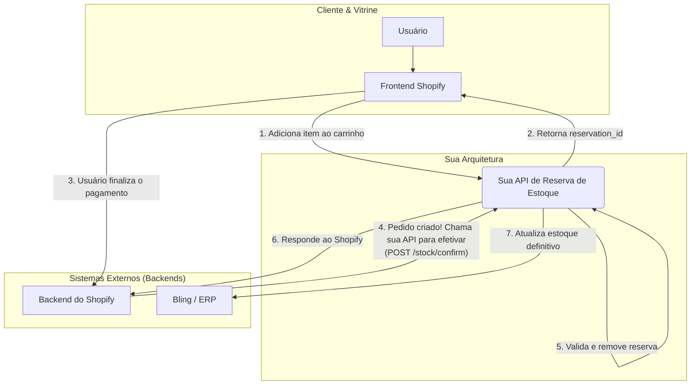

```mermaid
graph TD
    subgraph "Cliente & Vitrine"
        User[Usuário] --> A[Frontend Shopify];
    end

    subgraph "Sua Arquitetura"
        B(Sua API de Reserva de Estoque);
    end

    subgraph "Sistemas Externos (Backends)"
        ShopifyBE[Backend do Shopify];
        C[Bling / ERP];
    end

    %% Fluxo de Reserva
    A -- "1. Adiciona item ao carrinho" --> B;
    B -- "2. Retorna reservation_id" --> A;

    %% Fluxo de Confirmação
    A -- "3. Usuário finaliza o pagamento" --> ShopifyBE;
    ShopifyBE -- "4. Pedido criado! Chama sua API para efetivar<br>(POST /stock/confirm)" --> B;
    B -- "5. Valida e remove reserva" --> B;
    B -- "6. Responde ao Shopify" --> ShopifyBE;
    B -- "7. Atualiza estoque definitivo" --> C;

```