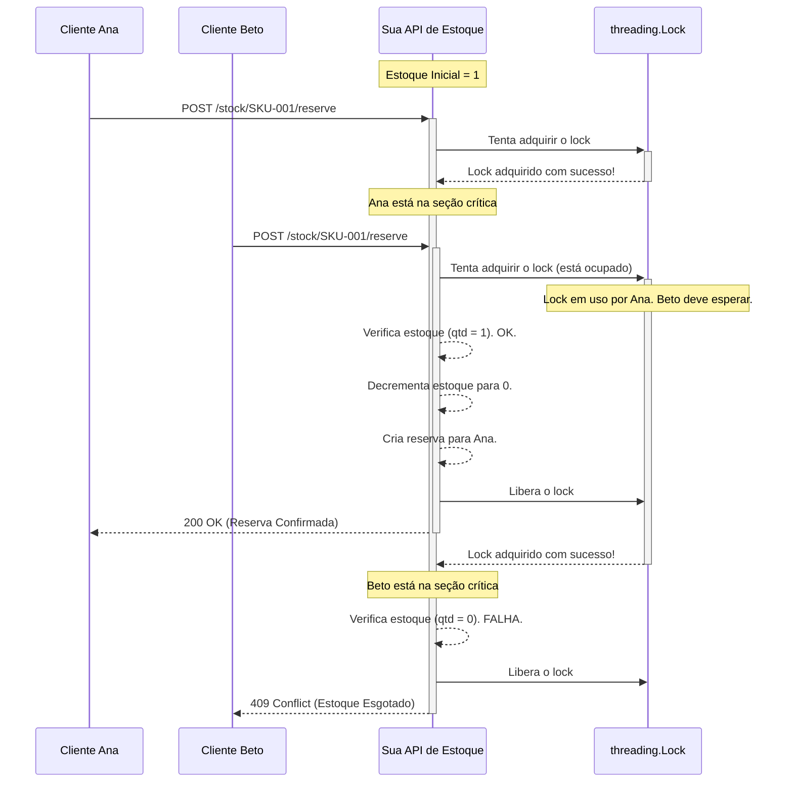
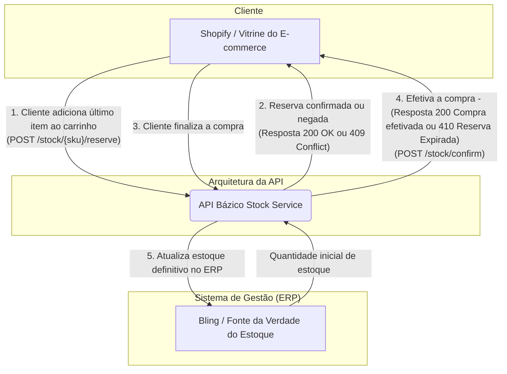

## A mágica acontecendo
Foi utilizado o mecanismo de Locking pessimista - A API possui uma "Porta" com a quantidade de items do estoque e para acessar essa informação existe somente uma "Chave"(No código, o objeto threading.Lock), no momento que um cliente adicionar um item ao carrinho ele tenta pegar essa chave para verificar a quantidade de itens no estoque, se a chave estiver disponível ele altera a quantidade do estoque e devolve a chave, se a chave estiver ocupada ele aguarda o outro processo finalizar para só então prosseguir. Este processo garante que a operação crítica de "verificar-e-modificar" o estoque seja indivisível. Isso elimina a race condition e assegura que, mesmo que dois clientes cliquem "comprar" simultaneamente, o último item será vendido de forma justa e consistente para apenas um deles.

### Diagrama de sequência que mostra o funcionamento do Locking Pessimista

## Diagrama da Arquitetura - Como a API se conecta

## Relatório de Raciocínio
### A - Decisões de Arquitetura
_Seguindo os objetivos e princípios da Bázico a experiência do cliente é o requisito de negócio mais crítico. Logo, garantir uma experiência de compra impecável sob alta demanda, onde é inaceitável vender um produto já esgotado é fundamental._
-> Criar um microserviço para desacoplar a lógica de reserva, permitindo a escala e otimização do componente mais crítico da campanha.
-> Foi utilizado o FastAPI como framework devido a sua alta perfomance, facilidade de prototipagem e geração de documentação automática, o que casou com o escopo do projeto.
-> Para garantir a atomicidade da operação de reserva foi utilizado Locking Pessimista, para prevenir a "corrida pelo último item", criando uma fila para requisições simultâneas.
-> Prós: Desacoplamento, Especialização e desempenho. Por ser um serviço a parte ajuda a descarregar o peso no estoque principal(Bling) principalmente em eventos como a BaziWeek, e permite utilizar tecnologias e escalar sem afetar a experiência do usuário.
-> Contras: Aumenta a complexidade arquitetural por ser mais um componente que precisa ser implantado, monitador e mantido. ConsistÊncia de dados uma vez que surge a necessidade de garantir a sicronização de dados entre o serviço de reserva e o ERP. Se torna um ponto de falha já que por ser projetado para isolar falhas de outros sistemas, ele mesmo se torna um objeto crítico necessitando alta disponibilidade.

### B - Diário de IA
_Modelo utilizado Gemini 2.5 PRO_
-> Gerar o boilerplate da API em FastAPI
-> Debater estratégias para lidar com a race condition
-> Geração de código Mermaid para criação dos diagramas em Markdown
-> Consultar estratégias para implementação de Workers e ferramentas possíveis para serem utilizadas em produção;

### C - Critica à IA
Foi sugerido inicialmente a utilização de um componente singular id, para identificar as reservas, o que eu sugeri foi utilizar uuid para garantir um identificador único entre os microserviços a chance de colisão é imensamente baixa.

### D - Plano de Produção
-> Banco de Dados em memória(Como o Redis) devido a o gerenciamento das reservas serem temporárias e volatéis, possui expiração automática de chave(TTL) o que seria útil para excluir reservas expiradas.
-> Logs estruturados em formato JSON, para os eventos importantes da plataforma(Reserva criada, falhou, falta de estoque, expirada)
-> Utilizar ferramentas como o ELK Stack para gerenciar os logs, facilitando a investigação de problemas.
-> Utilizar o Prometheus para coletar métricas da API junto com o Grafana para criar dashboards visuais
-> Criar alertas automatizados com o Alertmanager(Do prometheus) e enviar para canais críticos como o Slack.