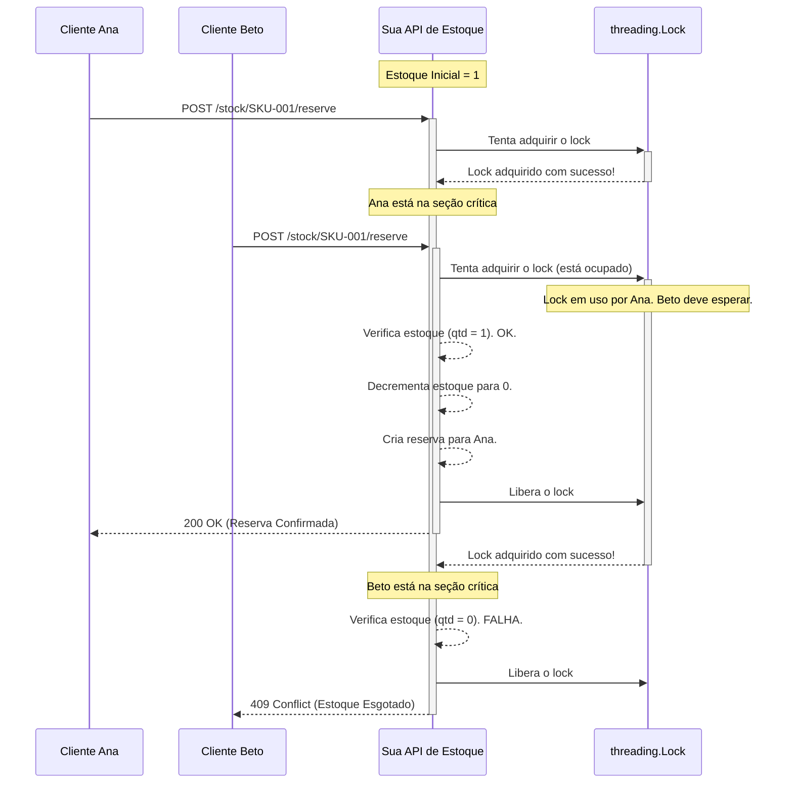
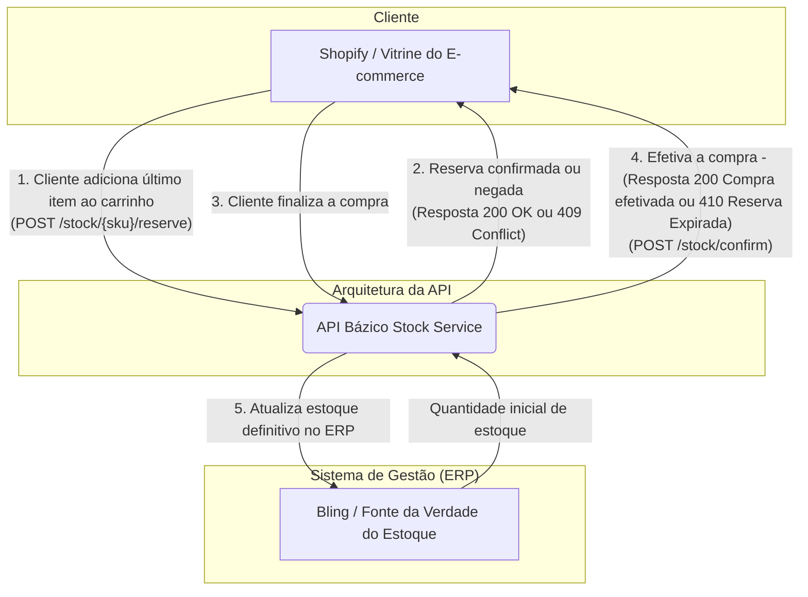

## A mágica acontecendo
### Foi utilizado o mecanismo de Locking pessimista - A API possui uma "Porta" com a quantidade de items do estoque e para acessar essa informação existe somente uma "Chave"(No código, o objeto threading.Lock), no momento que um cliente adicionar um item ao carrinho ele tenta pegar essa chave para verificar a quantidade de itens no estoque, se a chave estiver disponível ele altera a quantidade do estoque e devolve a chave, se a chave estiver ocupada ele aguarda o outro processo finalizar para só então prosseguir. Este processo garante que a operação crítica de "verificar-e-modificar" o estoque seja indivisível. Isso elimina a race condition e assegura que, mesmo que dois clientes cliquem "comprar" simultaneamente, o último item será vendido de forma justa e consistente para apenas um deles.

### Diagrama de sequência que mostra o funcionamento do Locking Pessimista

## Diagrama da Arquitetura - Como a API se conecta

## Relatório de Raciocínio

