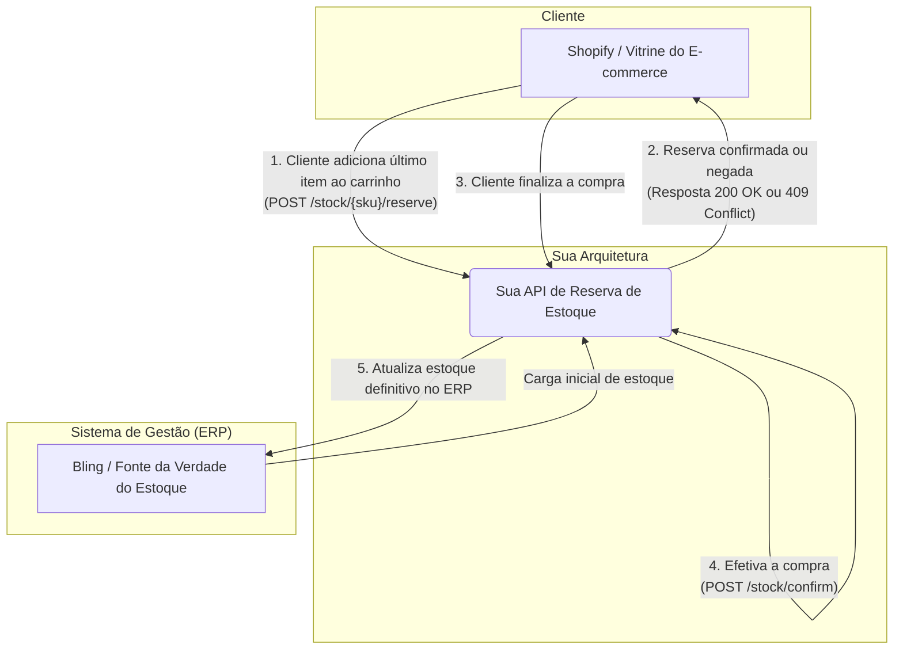

```mermaid
graph TD
    subgraph "Cliente"
        A[Shopify / Vitrine do E-commerce]
    end

    subgraph "Sua Arquitetura"
        B(Sua API de Reserva de Estoque)
    end

    subgraph "Sistema de Gestão (ERP)"
        C[Bling / Fonte da Verdade do Estoque]
    end

    %% Fluxo Principal de Reserva (Alta Frequência)
    A -- "1. Cliente adiciona último item ao carrinho<br>(POST /stock/{sku}/reserve)" --> B;
    B -- "2. Reserva confirmada ou negada<br>(Resposta 200 OK ou 409 Conflict)" --> A;

    %% Fluxo de Confirmação de Compra (Menor Frequência)
    A -- "3. Cliente finaliza a compra" --> B;
    B -- "4. Efetiva a compra<br>(POST /stock/confirm)" --> B;
    B -- "5. Atualiza estoque definitivo no ERP" --> C;

    %% Fluxo de Sincronização Inicial (Baixa Frequência)
    C -- "Carga inicial de estoque" --> B;
```
